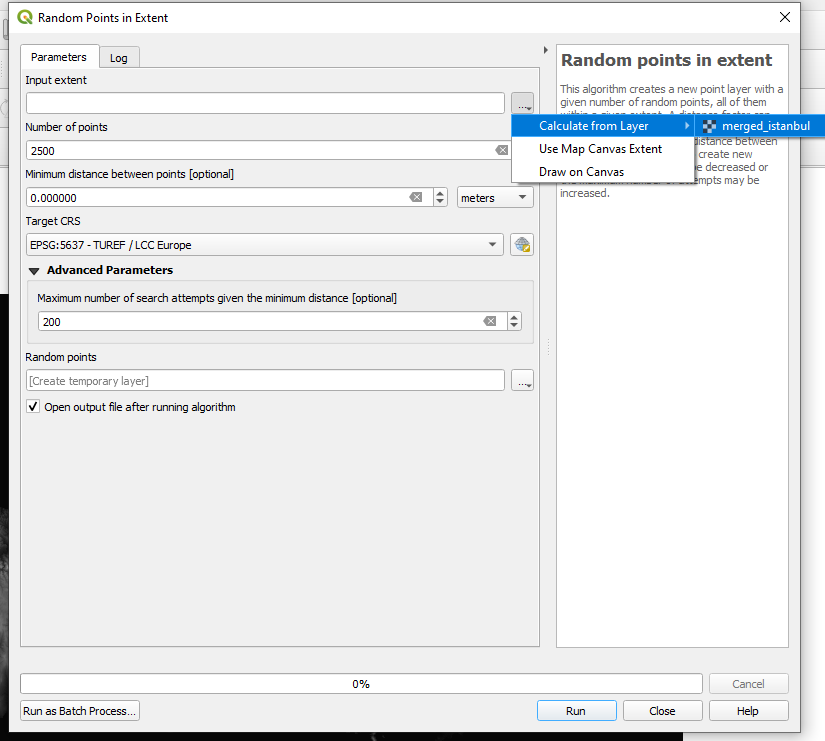

# 1. Vektör ve Raster Veriler Arası İşlemler

## 1.1. Piksel Değerlerine Göre Vektör Veri İçin Öznitelik Elde Etme

İlk olarak bu bölüme ait verilerin bulunduğu dizinden, İstanbul il sınırına göre kırpılmış 'merged_istanbul.tif' isimli DEM verisi çalışmaya eklenir. Proje referans sisteminin "EPSG:5637 - TUREF / LCC Europe" olmasına dikkat edilmelidir.

 

 

Kullanılacak nokta veri seti rastgele olarak oluşturulacaktır. Bunun için üst menüden "Vector -> Research Tools -> Random Points in Extent... " yolu izlenerek gerekli araca ulaşılır.

 

 

Açılan pencerede, rastgele noktaların oluşturulacağı kapsam belirlenmelidir. Bunun için "Input Extent" alanının yanında bulunan "..." butonuna tıklanır. "Calculate from Layer" seçeneğinden eklediğimiz DEM verisi seçilir ve alan belirlenir. Ardından "oluşturulacak nokta sayısı", "hedef referans sistemi" gibi tanımlamalar yapılarak işlem çalıştırılır. 

 

 

 

 

Oluşturulan noktalar çalışmaya eklendikten sonra, DEM katmanında noktanın bulunduğu piksele denk düşen yükseklik değerlerini elde etmek amacıyla "Araç kutusu (Toolbox "CTRL+ALT+T)" içerisinde "Raster Analysis" sekmesi altında bulunan "Sample Raster Values" aracına ulaşılır. 

 

 

Açılan pencerede girdi katman, kullanılacak raster katman, elde edilen değerlerle oluşacak yeni katmanın ismi gibi değişkenler belirlenir ve işlem çalıştırılır.

 

 

Çıktı katman çalışmaya eklendikten sonra, katmanın öznitelik tablosunda eklenen alan ve değerler görülebilir.

 

 

 

Benzer bir şekilde, alanlara ait ortalama değerleri elde etmek için yine bir Raster analiz aracı olan "Zonal Statistics" aracı kullanılabilir. Veri dizininde bulunan "istanbul_ilceler.geojson" dosyası çalışmaya eklenir. Araç kutusundan "Zonal Statistics" aracına ulaşılır.

 

 

Açılan pencerede girdi katman, kullanılacak raster katman, yeni oluşacak alan ismi ve hesaplanacak istatistikler (en küçük, en büyük, ortalama v.b.) seçilir ve çalıştırılır. Çıktı çalışmaya eklenir.

 

 

 

 

Yeni katmanın öznitelik tablosuna ulaşıldığında seçilen değerlerin hesaplandığı görülebilir.

 

 

 

## 1.2. Yükseklik Bilgisi İçeren Vektör Verilerden DEM oluşturma

Bir önceki çalışmada oluşturulan ve yükseklik değerleri eklenen nokta katmanı kullanarak "TIN Interpolation" yöntemi ile raster veri elde edilecektir. Bunun için "Araç Kutusu -> Interpolation -> TIN Interpolation" aracına ulaşılır. 

 

 

Açılan pencerede vektör katmanı, interpolasyon için kullanılacak alan tanımlanır. Hesaplama alanı, çıktı raster için çözünürlük parametreleri de belirlendikten sonra işlem çalıştırılır. Piksel boyutunun küçüklüğü ve girdi katmandaki eleman sayısı ile oluşacak ürünün kalitesi doğru orantılı olacaktır fakat aynı ölçüde hesaplama süresinin de artacağı unutulmamalıdır. Bu örnekte tüm İstanbul üzerinde hesaplama yapıldığından piksel boyutu ve girdi sayısı düşük tutulmuştur. 

 

 

Oluşan ürün aşağıdaki gibidir.

 

 

Yine benzer şekilde eşyükselti eğrilerinden de DEM verisi elde etmek mümkündür. Bu bölümün veri dizininde bulunan "buyukada_contours.geojson" verisi çalışmaya eklenir. "TIN Interpolation" aracı açılır ve parametreler aşağıdaki gibi ayarlanır ve işlem çalıştırılır.

 

 

Çıktı aşağıdaki gibidir.

 

 