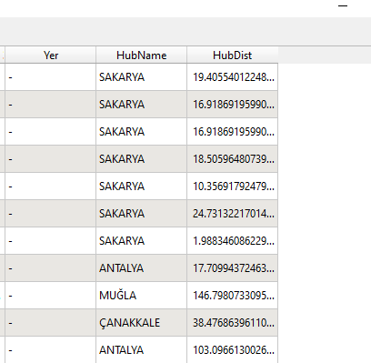

# 2. Mekansal Analiz Araçları

## 2.1. En Yakın Komşu Analizi

Bu çalışmada temel seviyede, yakınlık analizi için kullanılan bazı araçlar anlatılmıştır. Öncelikle bu bölümün "Veriler" dizininden "afad_deprem.geojson" ve "sehir_merkezleri.geojson" vektör verileri çalışmaya eklenir. Deprem verileri [AFAD 1900 - 20xx Deprem Kataloğu(M >= 4.0)](https://deprem.afad.gov.tr/depremkatalogu#) sayfasından, şehir merkezleri verileri ise [Humdata - Turkey - Subnational Administrative Boundaries](https://data.humdata.org/dataset/turkey-administrative-boundaries-levels-0-1-2) sayfasından edinilmiştir.

 

 

Depremlerin meydana geldiği konumlara en yakın olan şehir merkezlerinin ve bu merkezlere olan uzaklıkların hesaplanması istenmektedir. İlk olarak araç kutusundan "Vector Analysis -> Distance to Nearest Hub (points)" aracına ulaşılır.

 

 

Açılan pencerede kaynak katman, hedef merkezler katmanı, uzunluk birimi gibi parametreler belirlenerek işlem çalıştırılır.

 

 

Oluşan yeni katmanın öznitelik tablosu incelendiğinde en yakın merkez ve uzaklık alanlarının eklendiği görülebilir.

 

 

"Distance to Nearest Hub (Line to Hub)" aracı ile ise başlangıç noktalarından en yakındaki hedef noktaya çizgiler çizilebilir. Parametreler nokta aracına benzer şekilde aşağıdaki gibidir.

 

 

Oluşan katmanlar aşağıdaki gibidir.

 

 

 

## 2.2. Çok Kriterli Uygunluk Analizi 

 

### Veri Seti

 

1. CORINE (Coordination of Information on the Environment - Çevresel Bilginin Koordinasyonu) Arazi Örtüsü - Raster | [Kaynak](https://land.copernicus.eu/pan-european/corine-land-cover)

2. OSM - Eskişehir Porsuk Çayı verisi - Çizgi 

3. OSM - Eskişehir Kafeler verisi - Nokta 

4. OSM - Eskişehir Ana Yollar verisi - Çizgi 

5. OSM - Eskişehir Hastaneler verisi - Çokgen

6. OSM - Eskişehir Parklar verisi - Çokgen 

7. OSM - Eskişehir Tramvay Ağı verisi - Çizgi

 

### Çalışmanın Amacı

Bir senaryo kurgulanarak, Eskişehir'e yerleşmek isteyen hayali bir kişinin yaşamak istediği bölgede olmasını istediği koşullar belirlenmiştir. Belirlenen koşullara göre en uygun yerlerin bulunması amaçlanmıştır. 

Aşağıdaki koşulların sağlanması beklenmektedir:

1. Sürekli veya süreksiz kentsel doku içerisinde bulunmalıdır.
2. Porsuk Çayı'na en fazla 2 kilometre mesafede bulunmalıdır.
3. En fazla 1 kilometre mesafede en az bir kafe bulunmalıdır.
4. Ana yola uzaklığı en fazla 200 metre olmalıdır.
5. En fazla 5 kilometre mesafede en az bir hastane bulunmalıdır.
6. En fazla 1 kilometre mesafede en az bir park bulunmalıdır.
7. Tramvay ağına en fazla 1 kilometre mesafede olmalıdır.

---

 

 

İlk olarak projeye verilerin bulunduğu dizinden "Eskisehir/Landuse_Corine/landuse_raster.tif" yolundaki arazi örtüsü verisi eklenir. 

 

 

Ardından katman özellikleri penceresi açılır, pencerenin alt kısmında bulunan "Style" sekmesinden "Load Style" butonuna ulaşılır ve aynı dizinin "Legend" alt dizininde bulunan katman ayarları dosyası içe aktarılır. 

 

 

 

 

Raster katmanının görünümü aşağıdaki gibi olacaktır.

 

 

Sürekli ve süreksiz kentsel doku alanlarına göre sınıflandırma yapmak için araç kutusundan "Raster Calculator" aracı açılır. Aşağıdaki ifadeye göre yeniden sınıflandırma yapılır. Buradaki amaç; piksel değerleri kentsel doku alanlarına denk gelen alanların değerini '100', diğer alanların değerini ise '0' olarak tekrar hesaplamaktır. 

 

> 100 * ("landuse_raster@1" = 1 OR "landuse_raster@1" = 2)

 

Diğer alanlar ise şekildeki gibi ayarlanır ve işlem tamamlanır.

 

 

Yeniden sınıflandırma sonucu şekildeki gibidir. Beyaz alanlar kentsel doku alanlarını temsil etmektedir.

 

 

Bu işlemin ardından uygulamada kullanılacak vektör katmanları da projeye eklenir.

 

 

Vektör katmanları raster katmanlara çevirmek için araç kutusundan "Rasterize (Vector to Raster)" araçı açılır. 

 

 

Açılan pencerede girdi katman seçilir. Parametreler aşağıdaki gibi düzenlenir ve işlem çalıştırılır.

 

 

Kafe katmanının rasterize edilmiş hali aşağıdaki gibidir. 

 

 

Bu işlem diğer katmanlar için de tekrarlanır. Sonuç aşağıdaki gibidir.

 

 

Bir diğer adım ise "Proximity (Raster Distance)" aracı kullanılarak her bir katmanın yukarıda belirtilen şartlara göre yakınlıklarının hesaplanmasıdır. Bunun için yine araç kutusunda GDAL sekmesinde bulunan "Proximity (Raster Distance)" aracı açılır. 

 

 

Açılan pencerede örnek olarak kafelerin bulunduğu raster katmanı eklenmiştir. 1000 metre şartını sağlayacak şekilde tampon bölgeler oluşturulacaktır. Parametreler aşağıdaki gibidir.

 

 

Kafelerden 1 km uzaklığa kadar oluşan çıktı katman şekildeki gibidir. 

 

 

Diğer katmanlar için de şartlara göre yakınlık katmanları oluşturulur. 

 

 

Daha sonra yakınlıklara göre yeniden sınıflandırma yapılmalı ve belirli aralıklara 0 - 100 arası puanlar verilmelidir. Bunun için "Raster Calculator" aracı açılır. Aralıklar ve her bir aralığın alacağı yeni değer belirlenerek bir ifade tanımlanır. Örnek olarak kafe yakınlık katmanı kullanılmıştır.

 

 

Kafe katmanı için ifade:

> 0 * ("proximity_cafe_1km@1" > 1000 ) + 25 * ("proximity_cafe_1km@1" <= 1000) * ("proximity_cafe_1km@1" > 750) + 50 * ("proximity_cafe_1km@1" <= 750 ) * ("proximity_cafe_1km@1" > 500 ) + 75 * ("proximity_cafe_1km@1" <= 500 ) * ("proximity_cafe_1km@1" > 250 ) + 100 * ("proximity_cafe_1km@1" <= 250 ) * ("proximity_cafe_1km@1" > 0 ) 

 

Değerlere göre semboloji ayarlamaları yapıldıktan sonra görünüm şekildeki gibidir.

 

 

Diğer katmanlar için ifadeler şu şekilde olabilir:

Ana Yollar için: 

> 0 * ("proximity_highway_200m@1" > 200 ) + 25 * ("proximity_highway_200m@1" <= 200 ) * ("proximity_highway_200m@1" > 150) + 50 *  ("proximity_highway_200m@1" <= 150 ) * ("proximity_highway_200m@1" > 100) + 75 *  ("proximity_highway_200m@1" <= 100 ) * ("proximity_highway_200m@1" > 50) + 100 *  ("proximity_highway_200m@1" <= 50 ) * ("proximity_highway_200m@1" > 0) 

 

Hastaneler için: 

> 0 * ("proximity_hospital_5km@1" > 5000) + 25 *  ("proximity_hospital_5km@1" <= 5000) * ("proximity_hospital_5km@1" > 3750)  + 50 *  ("proximity_hospital_5km@1" <= 3750) * ("proximity_hospital_5km@1" > 2500) + 75 *  ("proximity_hospital_5km@1" <= 2500) * ("proximity_hospital_5km@1" > 1250) + 100 *  ("proximity_hospital_5km@1" <= 1250) * ("proximity_hospital_5km@1" > 0) 

 

Parklar için:

> 0 * ("proximity_park_1km@1" > 1000 ) + 25 * ("proximity_park_1km@1" <= 1000) * ("proximity_park_1km@1" > 750) + 50 * ("proximity_park_1km@1" <= 750 ) * ("proximity_park_1km@1" > 500 ) + 75 * ("proximity_park_1km@1" <= 500 ) * ("proximity_park_1km@1" > 250 ) + 100 * ("proximity_park_1km@1" <= 250 ) * ("proximity_park_1km@1" > 0 ) 

 

Nehir katmanı için: 

> 0 * ("proximity_river_2km@1" > 2000 ) + 25 * ("proximity_river_2km@1" <= 2000) * ("proximity_river_2km@1" > 1500) + 50 * ("proximity_river_2km@1"  <= 1500 ) * ("proximity_river_2km@1"  > 1000 ) + 75 * ("proximity_river_2km@1"  <= 1000 ) * ("proximity_river_2km@1" > 500 ) + 100 * ("proximity_river_2km@1"  <= 500 ) * ("proximity_river_2km@1" > 0 ) 

 

Tramvay katmanı için: 

> 0 * ("proximity_tram_1km@1" > 1000 ) + 25 * ("proximity_tram_1km@1"  <= 1000) * ("proximity_tram_1km@1"  > 750) + 50 * ("proximity_tram_1km@1"  <= 750 ) * ("proximity_tram_1km@1"  > 500 ) + 75 * ("proximity_tram_1km@1" <= 500 ) * ("proximity_tram_1km@1"  > 250 ) + 100 * ("proximity_tram_1km@1"  <= 250 ) * ("proximity_tram_1km@1"  > 0 ) 

 

Son olarak oluşturulan tüm katmanlar birleştirilerek bir sonuç katmanı oluşturulmalıdır. Yine raster hesaplayıcı ile aşağıdaki gibi bir ifadeyle yeni katman oluşturulur. 

> ("cafe_1km_reclass@1" + "highway_200m_reclass@1" + "hospital_5km_reclass@1" + "park_1km_reclass@1" + "river_2km_reclass@1" + "tram_1km_reclass@1" ) * ( "landuse_reclass@1" = 100 )

 

İşlem sonucu aşağıdaki gibidir.

 

 

Katman sembolojisinde gerekli ayarlamalar yapıldıktan sonra görünüm:

 

 

 

 

## 2.3. Grafik Modelleyici ile İş Akışlarını Modelleme

Bir önceki çalışmada yapılan vektör katmanı raster katmana çevirme ve üretilen raster katmandan yakınlık katmanı oluşturma işlemlerini grafik modelleyiciyle modelleyerek yeni bir araç oluşturulması amaçlanmıştır. 

